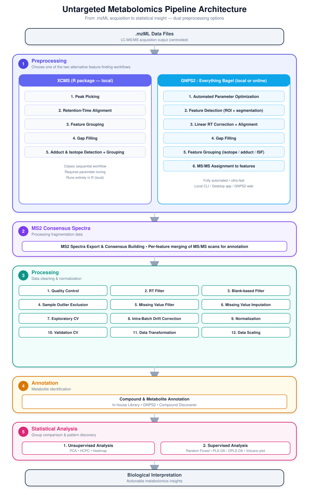

<p align="center">


</p>

# Metabolomics Workflow for Untargeted LC-MS/MS

**Author :** Maël Marquet —
[mael.marquet\@univ-grenoble-alpes.fr](mailto:mael.marquet@univ-grenoble-alpes.fr)\
**Affiliation :** GExiM (Grenoble Expertise in Metabolomics), TrEE
(Translational Microbiology - Evolution - Engineering), UMR 5525 TIMC
(Recherche Translationnelle et Innovation en Médecine et Complexité),
Université Grenoble Alpes\
**License :** MIT\
**Status :** Active development

------------------------------------------------------------------------

## Overview

This repository provides a dynamic and user-guided workflow with Shiny app for
untargeted LC-MS/MS metabolomics data processing and analysis. The
pipeline is designed to be reproducible, modular, and accessible to both
beginner and advanced R users.

The workflow covers the full analysis chain : from `.mzML` file import
to statistical analysis, with interactive Shiny-based guidance at key
steps.

The complete workflow is summarized in the diagram below :

<p align="center">



</p>

------------------------------------------------------------------------

## Requirements

### R version

This workflow requires **R 4.5.2**.

### Computational requirements

The computational resources required by the workflow depend on the
number of `.mzML` files, the acquisition size, the number of detected
features, and the number of samples.

The following values are indicative and can be adapted depending on the
dataset and the processing strategy :

| Resource | Recommended |
|--------------------------------|----------------------------------------|
| Operating system | Windows / macOS / Linux |
| R version | R 4.5.2 |
| CPU | 8 cores |
| RAM | 32 GB |
| Storage | SSD recommended ; sufficient space for `.mzML` data, intermediate files and results |
| Internet connection | Required for package installation and may be required for external annotation or database-dependent steps |
| GPU | Not required |

### Additional considerations

-   **RAM:** Large LC-MS/MS datasets, feature matrices, and parallel
    processing can require substantial memory.
-   **CPU:** Several steps can benefit from parallel computation,
    particularly feature processing and some statistical analyses.
-   **Storage:** Additional disk space is required for `.mzML` files,
    intermediate objects, checkpoints, and generated results.
-   **GPU:** GPU acceleration is not required for the current workflow.

### CRAN packages (Exact versions are pinned in renv.lock)

The following packages are automatically installed and loaded by the
main script :

| Package      | Role                                      |
|--------------|-------------------------------------------|
| shiny        | Interactive interface                     |
| dplyr        | Data manipulation                         |
| ggplot2      | Data visualization                        |
| tidyr        | Data reshaping                            |
| stringr      | String manipulation                       |
| tibble       | Modern data frames                        |
| readxl       | Read Excel files                          |
| jsonlite     | JSON parsing                              |
| viridis      | Colorblind-friendly palettes              |
| ggrepel      | Non-overlapping labels                    |
| ggtext       | Text Rendering Support for ggplot2        |
| factoextra   | Multivariate visualization                |
| matrixStats  | Efficient matrix statistics               |
| e1071        | ML & stats tools                          |
| patchwork    | Combine ggplots                           |
| FactoMineR   | Multivariate analysis                     |
| vegan        | Ecological statistics (PERMANOVA)         |
| colourpicker | Color picker for Shiny                    |
| ggdendro     | Dendrogram plotting                       |
| circlize     | Circular visualization                    |
| cluster      | Clustering algorithms                     |
| ranger       | Random Forest                             |
| gridExtra    | Combine plots                             |
| lme4         | Mixed effects models                      |
| lmerTest     | Tests for mixed models                    |
| future       | Future parallel processing                |
| future.callr | Callr backend for future                  |
| parallelly   | Parallel backend utilities                |
| future.apply | Parallel apply functions                  |
| VIM          | Missing data visualization and imputation |
| reactable    | Interactive tables                        |
| caret        | Machine learning utilities                |
| openxlsx     | Write and style Excel files               |
| igraph       | Graph-based feature grouping              |
| ggsignif     | Significance Brackets for 'ggplot2'       |


### Bioconductor packages

| Package        | Role                                         |
|----------------|----------------------------------------------|
| mzR            | Mass spectrometry data access                |
| MSnbase        | MS data processing                           |
| xcms           | LC-MS preprocessing                          |
| BiocParallel   | Parallel computing                           |
| impute         | Missing value imputation                     |
| imputeLCMD     | Missing value imputation (LC-MS)             |
| ComplexHeatmap | Advanced heatmaps                            |
| ropls          | OPLS-DA / PLS-DA models                      |
| Spectra        | Manage and Access MS data                    |
| MsCoreUtils    | Mass spectrometry utilities                  |
| MsBackendMgf   | Import/export of MS/MS spectra in MGF format |
| MsBackendMsp   | Import/export of MS/MS spectra in MSP format |

### Installing on a new computer (step-by-step)

If you are starting from a computer with nothing installed, follow these
steps in order.

**1. Install R**

Download and install R from [CRAN](https://cran.r-project.org/) (choose
your operating system — Windows, macOS, or Linux). Use the version (R
4.5.2).

**2. Install compiler tools**

Some packages (particularly Bioconductor ones) may not have a
pre-compiled binary available and need to be built from source. This
requires a compiler toolchain, which is **not installed by default** on
any operating system.

-   **Windows** : download and install
    [Rtools45](https://cran.r-project.org/bin/windows/Rtools/) (matching
    R 4.5.x). During installation, keep the default option to add Rtools
    to the system PATH.
-   **macOS** : install the Xcode Command Line Tools by running this in
    Terminal :

``` bash
  xcode-select --install
```

-   **Linux (Debian/Ubuntu)** : install a compiler and the development
    libraries required by several Bioconductor packages :

``` bash
  sudo apt update
  sudo apt install build-essential gfortran libxml2-dev libcurl4-openssl-dev \
    libssl-dev libfontconfig1-dev libharfbuzz-dev libfribidi-dev \
    libfreetype6-dev libpng-dev libtiff5-dev libjpeg-dev
```

Package names may differ slightly on other distributions (Fedora, Arch,
etc.) — check your package manager.

**3. Install RStudio**

Download and install [RStudio
Desktop](https://posit.co/download/rstudio-desktop/) (free version).
This is the interface you will use to run R code.

**4. Install Git**

Git is required to download (clone) the repository from GitHub.

-   Windows : download and install [Git for
    Windows](https://git-scm.com/download/win)
-   macOS : open Terminal and run `git --version` — this usually prompts
    installation automatically
-   Linux : run `sudo apt install git` (Debian/Ubuntu) or the equivalent
    for your distribution

**5. Clone the repository**

Open RStudio, then go to **File \> New Project \> Version Control \>
Git**, and paste the repository URL :

```         
https://github.com/Mael-Marquet/Metabolomic-workflow-for-untargeted-LC-MS-MS.git
```

Choose a folder on your computer and click **Create Project**. RStudio
will download the repository and open it automatically.

*(Alternative : open a terminal, run
`git clone https://github.com/Mael-Marquet/Metabolomic-workflow-for-untargeted-LC-MS-MS.git`,
then open the `.Rproj` file inside the downloaded folder.)*

**6. Restore the exact package environment**

The repository includes a `renv.lock` file that records the exact
version of every package used during development, so your environment
matches the one this workflow was built and tested on.

The following files are already included in the repository — no manual
setup needed :

-   `renv.lock` — the snapshot of all package versions
-   `renv/` — the renv internal folder
-   `.Rprofile` — automatically activates renv when the project is
    opened

Once the project is open in RStudio, run in the R console :

``` r
install.packages("renv")
renv::restore()
```

This installs every package at the correct version into a project-local
library. It can take a while the first time, depending on your
connection.

This step is recommended — the `check_and_load()` function in the main
script can also install missing packages on its own. Use
`renv::restore()` only if you need a guaranteed identical environment to
the one used for development.

------------------------------------------------------------------------

## Input Files

The workflow expects the following input files:

### Raw data

-   `.mzML` files for LC-MS/MS raw data

### Metadata file

-   Format : **Excel (`.xlsx`)** or **CSV (`.csv`)**
-   The Shiny interface provides guidance for creating and validating
    this file
-   A guide containing instructions, along with an example, will be
    provided when the code is run.

------------------------------------------------------------------------

## How to Use

### Step-by-step

To run the entire script in RStudio, select all code (Ctrl + A) and run
the selection (Ctrl + Enter) (recommended if you’re a beginner)

1.  Open the main execution script `Main_Script.R`.
2.  Run the installation and loading section.
3.  Follow the interactive Shiny windows when they appear.
4.  Press **Submit** in each window to validate choices and save
    parameters.
5.  Continue through the pipeline step by step.

*It is still recommended to run step by step at least once to understand
each stage.*

------------------------------------------------------------------------

## Important Notes

-   **Do not modify the code during execution** unless you know what you
    are doing.

-   Always press **Submit** when the figure or result you want to save
    is displayed.

-   Outputs are **saved automatically**.

-   `.RData` checkpoints are automatically saved and can be used to resume
  specific steps without restarting the entire workflow.

-   When a Shiny page becomes **grayed out**, the current step is
    finished. Close or leave the page and return to the R code to
    proceed with the next step.

To restore the data at a specific step :

``` r
load(file = "Rdata_checkpoint/'your_choice'.RData")
```

------------------------------------------------------------------------

## User Guidance

A Shiny-based interface is included to help users:

-   Create or validate the metadata file
-   Follow step-by-step execution instructions
-   Understand the workflow structure
-   Navigate advanced or partial execution safely


------------------------------------------------------------------------

## Outputs

The workflow automatically generates and saves:

-   Processed feature tables
-   Quality control plots (pre- and post-normalization)
-   Normalization and drift correction results
-   Statistical analysis figures (PCA, heatmap, volcano plot, etc.)
-   Annotation tables
-   General summary report


------------------------------------------------------------------------

## Root file directory structure

```

"your_root_file_name"/
├── Metadata/
├── mzML/
│   ├── mzML_data/
│   └── mzML_diluted_QC/
├── Rdata_checkpoint/
└── Results/
    ├── Charts/
    │   ├── 1_Pre-processing/
    │   ├── 2_Processing/
    │   │   ├── 01_Quality Control/
    │   │   ├── 02_RT_filter/
    │   │   ├── 03_Sample_Outlier_Exclusion/
    │   │   ├── 04_Missing_Value_Filter/
    │   │   ├── 05_Missing_Value_Imputation/
    │   │   ├── 06_Permissive_CV_pre_LOESS/
    │   │   ├── 07_Intra_Batch_Drift_Correction/
    │   │   ├── 08_Normalization/
    │   │   ├── 09_Strict_CV/
    │   │   ├── 10_Data_Transformation/
    │   │   └── 11_Data_Scaling/
    │   ├── 3_Annotation/
    │   ├── 4_Unsupervised_analyses/
    │   └── 5_Supervised_analyses/
    │
    ├── Data/
    │   ├── 1_Pre-processing/
    │   ├── 2_Processing/
    │   │   ├── 01_Quality Control/
    │   │   ├── 02_RT_filter/
    │   │   ├── 03_Sample_Outlier_Exclusion/
    │   │   ├── 04_Missing_Value_Filter/
    │   │   ├── 05_Missing_Value_Imputation/
    │   │   ├── 06_Permissive_CV_pre_LOESS/
    │   │   ├── 07_Intra_Batch_Drift_Correction/
    │   │   ├── 08_Normalization/
    │   │   ├── 09_Strict_CV/
    │   │   ├── 10_Data_Transformation/
    │   │   └── 11_Data_Scaling/
    │   ├── 3_Annotation/
    │   ├── 4_Unsupervised_analyses/
    │   └── 5_Supervised_analyses/
    │
    └── Parameters/
        ├── 1_Pre-processing/
        ├── 2_Processing/
        │   ├── 01_Quality Control/
        │   ├── 02_RT_filter/
        │   ├── 03_Sample_Outlier_Exclusion/
        │   ├── 04_Missing_Value_Filter/
        │   ├── 05_Missing_Value_Imputation/
        │   ├── 06_Permissive_CV_pre_LOESS/
        │   ├── 07_Intra_Batch_Drift_Correction/
        │   ├── 08_Normalization/
        │   ├── 09_Strict_CV/
        │   ├── 10_Data_Transformation/
        │   └── 11_Data_Scaling/
        ├── 3_Annotation/
        ├── 4_Unsupervised_analyses/
        └── 5_Supervised_analyses/
        
```

------------------------------------------------------------------------

## Limitations and Roadmap

-   Example datasets are not yet included in the repository.

------------------------------------------------------------------------

## License

This project is licensed under the **MIT License**. See the
[LICENSE](LICENSE) file for details.

------------------------------------------------------------------------

## Contact

**Maël Marquet**\
GExiM (Grenoble Expertise in Metabolomics)\
TrEE (Translational Microbiology - Evolution - Engineering)\
UMR 5525 TIMC, Université Grenoble Alpes\
[mael.marquet\@univ-grenoble-alpes.fr](mailto:mael.marquet@univ-grenoble-alpes.fr){.email}

For questions, suggestions, or collaboration, feel free to reach out by
email or open an issue on GitHub once the repository is made public.
